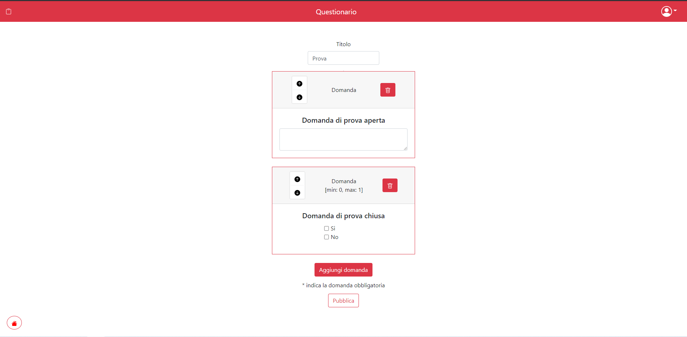

# Exam #1: "Questionario"
## Student: s281755 Lucani Alessandro 

## React Client Application Routes

- Route `/`: page that shows all the surveys available to the users and to the administrators the surveys that he have created
- Route `/login`: login page
- Route `/quiz_:id`: page that shows the survey with id = :id to the user
- Route `/new_quiz`: page that allows the creation of a new survey
- Route `/add_question`: page that allows the creation of a new question
- Route `/compilazioni_:id/utilizzatore_:user`: page that shows the answers to the survey with id = :id given by the user = :user (the local id of the user. Local means that if for example utilizzatore=2, the server is retriving the answers of the second user who filled the survey (second in time order))

## API Server

- GET `/api/quiz`
  
  Description: Get the full list of surveys

  Param: none

  Request Body : None

  Response: 200 OK (success) 500 (Internal Server Error) 

  Response Body: Array of objects, each describing one survey.

      [{
          id: 1,
          titolo: "Quiz1",
          compilazioni: 0        
      }]

- GET `/api/myquiz`
  
  Description: Get the list of surveys created by the administrator who made the request

  Param: none

  Request Body : None

  Response: 200 OK (success) 500 (Internal Server Error) 

  Response Body: Array of objects, each describing one survey.

      [{
          id: 1,
          titolo: "Quiz1",
          compilazioni: 0        
      }]

- GET `/api/quiz_:id`
 
  Description: Get the list of questions that belongs to the requested survey 

  Param: id (the id of the survey)

  Request Body : None

  Response: 200 OK (success) 500 (Internal Server Error) 400 (BadRequest)

  Response Body: Array of objects, each describing one question.

      [{
          id: 1,
          testo: "Nome:",
          min: 0,
          max: 1,
          tipo: "aperta",
          posizione: 1        
      }]

- GET `/api/quizAnswers_:id/:utilizzatore`

  Description: Get the list of answers to the requested survey given by the requested user 

  Param: id (the id of the survey), utilizzatore (the local id of the user. Local means that if for example utilizzatore=2, the server is retriving the answers of the second user who filled the survey (second in time order))

  Request Body : None

  Response: 200 OK (success) 500 (Internal Server Error) 400 (BadRequest)

  Response Body: Array of objects, each describing one answer.

      [{
          id: 1,
          testo: "Alessandro"
      }]
 
- GET `/api/quizTitle_:id`
 
  Description: Get the title on number of fillings of the requested survey 

  Param: id (the id of the survey)

  Request Body : None

  Response: 200 OK (success) 500 (Internal Server Error) 400 (BadRequest)

  Response Body: An objects describing the requested info.

      {
          titolo: "Quiz1",
          n: 0
      }
 
- GET `/api/answers_:id`
  
  Description: Get the options of a question

  Param: id (the id of the question)

  Request Body : None

  Response: 200 OK (success) 500 (Internal Server Error) 400 (BadRequest)

  Response Body: Array of objects, each describing one option.

      [{
          id: 1,
          testo: "Rosso"
      }]

- POST `/api/pubblicaQuiz`
   
  Description: Insert the survey entry in the db

  Param: None

  Request Body : An object containing the title of the survey

      {
          title: "Quiz1"
      }

  Response: 200 OK (success) 500 (Internal Server Error) 400 (BadRequest)

  Response Body: None

- POST `/api/pubblicaDomande`
  
  Description: Insert the questions entry in the db

  Param: None

  Request Body : Array of object, each describing one question.
      
      [{
          id: 1
          max: 1
          min: 0
          posizione: 1
          risposte: []
          testo: "Nome:"
          tipo: "aperta"
      }]

  Response: 200 OK (success) 500 (Internal Server Error) 400 (BadRequest)

  Response Body: None

- POST `/api/pubblicaRisposte`
  
  Description: Insert the answers entry in the db, update the number of filling of the survey

  Param: None

  Request Body : An object containing the id of the survey, the questions and the answers (a map the connect the question to the answer)
      
      {
        id: '1',
        quiz: [
          {
            id: 1,
            testo: 'Nome:',
            min: 1,
            max: 1,
            tipo: 'aperta',
            posizione: 1
          },
          {
            id: 2,
            testo: 'Macchine possedute?',
            min: 0,
            max: 2,
            tipo: 'chiusa',
            posizione: 2
          }
        ],
        risposte: [ [ 0, 'Alessandro' ], [ 1, [Array] ] ]
      }

  Response: 200 OK (success) 500 (Internal Server Error) 400 (BadRequest)

  Response Body: None

- POST `/api/sessions`

  Description: Authenticate the user for the login

  Param: none

  Request Body : None

  Response: 200 OK (success) 401 Unauthorized (the user is not authenticated)

  Response Body: An object containing the user information.

      {
          id: 1,
          username: "s281755@polito.it",
      }

- DELETE `/api/sessions/current`

  Description: Perform the logout

  Param: none

  Request Body : None

  Response: 200 OK (success)

  Response Body: None

- GET `/api/sessions/current`

  Description: Check whether the user is logged in or not

  Param: none

  Request Body : None

  Response: 200 OK (success) 401 Unauthorized (the user is not authenticated)

  Response Body: An object containing the user information.

      {
          id: 1,
          username: "s281755@polito.it",
      }

## Database Tables

- Table `domanda` - contains all the questions of the surveys
- Table `questionario` - contains all the surveys
- Table `risposte` - contains all the answers given to the surveys
- Table `risposte_chiuse` - contains all the options of the questions
- Table `user` - contains the registered users
  

## Main React Components

- `LoginComponent` (in `LoginComponent.js`): component that shows the login form
- `MyNavbar` (in `MyNavbar.js`): component that shows the navbar and has the login and logout buttons
- `MyQuiz` (in `MyQuiz.js`): component that shows the survey in all the various forms (when a user wants to compile a survey, when an administrator wants to create a survey or when he wants to view the answers), including all the question and answers in case it is necessary
- `MyQuestion` (in `MyQuestion.js`): component that renders a question with all the relative informations and options
- `QuestionForm` (in `QuestionForm.js`): component that shows the form for the creation of a new question
- `QuizViewer` (in `QuizViewer.js`): component that allows the browsing of the surveys (all the surveys or just the ones owned depending on the type of user) in the home page

(only _main_ components, minor ones may be skipped)

## Screenshot

## Users Credentials

- `s281755@polito.it`, `password` (He has created quiz1,quiz3)
- `alessandro.lucani@polito.it`, `alessandro` (He has created quiz2)
